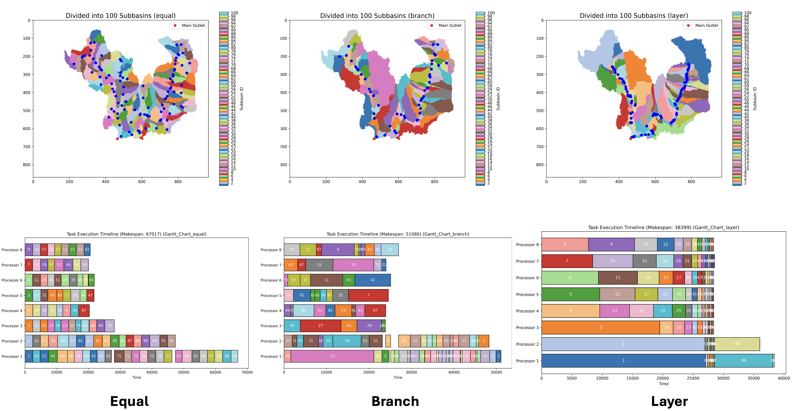

# User Manual: Watershed Subdivision Toolkit

This toolkit provides utilities for **subdividing watersheds into subbasins** and simulating task execution for ecohydrological modeling. It is designed to improve parallelization and workload balance in distributed simulations.

---

## Features

- **Watershed Subdivision**  
  Divide a watershed into subbasins using different strategies (`equal`, `branch`, `layer`).

- **Task Execution Simulation**  
  Simulate task scheduling across multiple processors with dependency resolution based on flow direction.

- **Visualization**  
  Generate subbasin maps, Gantt charts, and utilization plots for performance analysis.

---

## Installation Requirements

### Python Dependencies
- `numpy`
- `matplotlib`
- `pysheds`
- `pyproj`

Install via pip:
```bash
pip install numpy matplotlib pysheds pyproj
```

---

## Functions

### 1. `subdivide_catchments`
**Description:**  
Divide a watershed into subbasins based on flow direction and accumulation.

**Arguments:**
- `asc_file (str)` – Path to DEM file in ASC format.  
- `col, row (int)` – Coordinates of the watershed outlet.  
- `num_processors (int)` – Number of processors available.  
- `num_subbasins (int)` – Number of subbasins to divide.  
- `method (str)` – Subdivision method (`equal`, `branch`, `layer`).  
- `crs (str)` – Coordinate reference system.  
- `is_plot (bool)` – Whether to plot the resulting subdivision map.  

**Output:**  
Returns subbasin outlet coordinates and optionally generates a plot.

---

### 2. `simulate_task_execution`
**Description:**  
Simulate task scheduling across processors based on subbasin dependencies. Optionally generate a Gantt chart to visualize task execution.

---

## Methods

- **Equal**  
  Divides the watershed into subbasins of similar size.  
  Best for real-time inter-process interaction and balanced processor workloads.

- **Branch**  
  Hierarchically subdivides along river branches.  
  Best when many processors are available and CPU computation capacity is strong.

- **Layer**  
  Splits the watershed into two layers:  
  - Independent subbasins in the first layer.  
  - Dependent subbasins in the second layer.  
  Best for limited processors with strong storage capacity.

---

## Example Usage

```python
asc_file_path = "path/to/dem.asc"
col, row = 465, 656   # Main outlet coordinates
num_processors = 8
num_subbasins = 100

# Divide the watershed into subbasins
target_points = subdivide_catchments(
    asc_file=asc_file_path,
    col=col,
    row=row,
    num_processors=num_processors,
    num_subbasins=num_subbasins,
    method="layer",
    crs="EPSG:26910",
    is_plot=True
)
```

---

## Visualization

- **Subbasin Map** – Displays unique colors for each subbasin.  
- **Gantt Chart** – Shows task execution schedules across processors.  
- **Utilization Plot** – Analyzes basin numbers, makespan, and processor utilization.  



---
